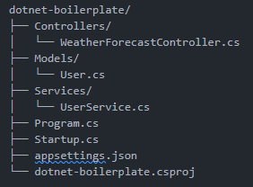

dotnet-boilerplate/
├── Controllers/
│   └── WeatherForecastController.cs
├── Models/
│   └── User.cs
├── Services/
│   └── UserService.cs
├── Program.cs
├── Startup.cs
├── appsettings.json
└── dotnet-boilerplate.csproj

